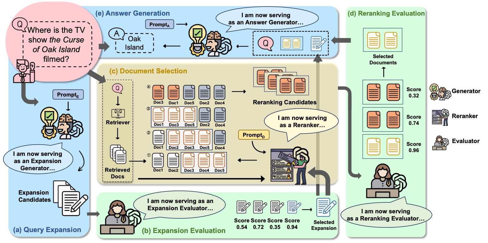

# Harnessing multi-role capabilities of large language models for open-domain question answering [WWW2024 **Oral**]  

Official implementation for our paper [Harnessing multi-role capabilities of large language models for open-domain question answering](https://arxiv.org/abs/2403.05217)

## Abstract

Open-domain question answering (ODQA) has emerged as a pivotal research spotlight in information systems. Existing methods follow two main paradigms to collect evidence: (1) The retrieve-then-read paradigm retrieves pertinent documents from an external corpus; and (2) the generate-then-read paradigm employs large language models (LLMs) to generate relevant documents. However, neither
can fully address multifaceted requirements for evidence. To this end, we propose LLMQA, a generalized framework that formulates the ODQA process into three basic steps: query expansion, document selection, and answer generation, combining the superiority of both retrieval-based and generation-based evidence. Since LLMs exhibit their excellent capabilities to accomplish various tasks, we instruct LLMs to play multiple roles as generators, rerankers, and evaluators within our framework, integrating them to collaborate in the ODQA process. Furthermore, we introduce a novel prompt optimization algorithm to refine role-playing prompts and steer LLMs to produce higher-quality evidence and answers. Extensive experimental results on widely used benchmarks (NQ, WebQ, and TriviaQA) demonstrate that LLMQA achieves the best performance in terms of both answer accuracy and evidence quality, showcasing its potential for advancing ODQA research and applications.



## Citation

Please cite the paper in the following format.

```bibtex
@inproceedings{sun2024harnessing,
  title={Harnessing multi-role capabilities of large language models for open-domain question answering},
  author={Sun, Hongda and Liu, Yuxuan and Wu, Chengwei and Yan, Haiyu and Tai, Cheng and Gao, Xin and Shang, Shuo and Yan, Rui},
  booktitle={Proceedings of the ACM Web Conference 2024},
  pages={4372--4382},
  year={2024}
}
```
